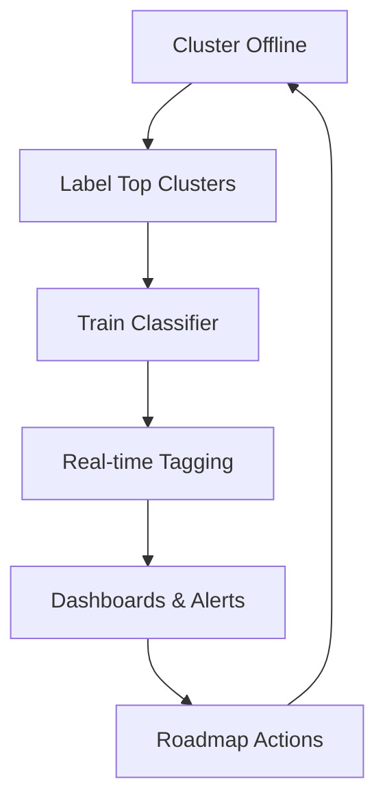

# From Chat Logs to Actionable Insights

Turning thousands of support conversations into clear product direction.

<!--
Open with the problem statement: too many chats, too little signal. Explain that the deck will show a lightweight approach to surface what matters most for roadmap decisions.
-->

---

## The Pain Today

* User conversations have too much detail
* You're not always the expert who knows where to look
* There's too much volume to go through manually
* Outputs are noisy and hard to scan

<!--
Share a war-story about scrolling through endless logs looking for a bug report. Talk about cognitive overload and the need for structure.
-->

---

## The Feedback Is Already There

> "We built feedback widgets... but users already told us everything in the chat."

* Chats hold raw, unfiltered pain points
* Manually reading works until you go viral
* We need a systematic approach, not another form

<!--
Point out that any extra survey or thumbs-up widget is lagging. The real signal is in the natural language the user already gave us.
-->

---

## Learning from Marketing Analytics

* Marketers slice by **age, gender, region**
* We slice by **topic, intent, capability**
* Goal: know where to **double-down** vs where to **improve**

<!--
Make the analogy clear: A/B testing creative is like testing product features on different user groups.
-->

---

## The Data to Decision Loop

1. Define your success metrics (KPIs)
2. Group conversations into clusters  
3. Compare clusters on your KPIs
4. Choose **build / fix / ignore** actions

<!--
Stress that looking at data without taking action is wasted effort. The loop only closes when we commit to a roadmap change.
-->

---

## When Manual Reading Stops Working

* **10-100 chats**: Read everything manually
* **1,000+ chats**: Use language models for clustering
* Surface the most representative threads per cluster

<!--
Share the inflection point: around 1k chats per day is where manual review becomes impossible.
-->

---

## What Clustering Reveals

* **Missing filters** users keep asking for
* **New data sources** to add to your index
* **Under-performing segments** (low satisfaction, long chats)

<!--
Give concrete examples: users asking for date range filters, or finance tickers not in your search index.
-->

---

## Quadrant Analysis Framework

* **High Traffic + High Satisfaction** = Double down
* **High Traffic + Low Satisfaction** = Fix immediately  
* **Low Traffic + High Satisfaction** = Monitor
* **Low Traffic + Low Satisfaction** = Consider removing

<!--
Walk through each quadrant with examples. High traffic/high satisfaction means invest more. High traffic/low satisfaction needs immediate fixes.
-->

---

## Building the Feedback Loop

<!--
Explain that the classifier keeps clusters alive in production, giving us time-series data and charts for each segment.
-->

---

## From Clusters to Better Products

Once you identify clusters, you can:

* **Build classifiers** to tag conversations in real-time
* **Create dashboards** to track trends over time  
* **Set up alerts** for concerning patterns
* **Make data-driven roadmap decisions**

<!--
Emphasize that this creates a feedback loop where data analysis directly informs product development decisions.
-->

---

## Getting Started

* **Example notebooks**: [github.com/567-labs/how-to-look-at-data](https://github.com/567-labs/how-to-look-at-data)
* **Deep-dive blog**: [improvingrag.com](http://improvingrag.com/)

Drop in your chat export and start clustering today.

<!--
Call to action: clone the repo, export your chat data, and begin tagging conversations to find actionable insights.
-->